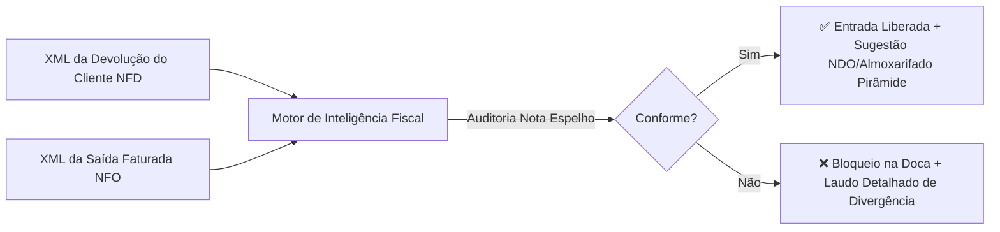

# DOSSIÊ DE HOMOLOGAÇÃO E VALIDAÇÃO FISCAL (NFO x NFD)
## Validador Fiscal de Devoluções Integrado ao ERP Pirâmide
**Destinatário Exclusivo:** Gerência Fiscal (Polliana)  
**Projeto:** Automação e Auditoria Tributária de Entrada de Devoluções  
**Data:** 25 de Agosto de 2026  
**Versão:** 1.0 — Documento Único de Homologação Oficial  

---

### 1. APRESENTAÇÃO E ESCOPO DO PROJETO

Este documento consolida em **um único dossiê técnico** todas as regras de negócio, parâmetros tributários das 4 empresas do grupo, fórmulas de rateio, catálogo de produtos, matriz de CFOPs e regras da Reforma Tributária implementadas no sistema.

O sistema realiza o cruzamento automatizado entre o **XML da Nota de Saída/Venda Original (NFO)** e o **XML da Nota de Devolução emitida pelo Cliente (NFD)**, garantindo conformidade fiscal absoluta antes da escrituração no **ERP Pirâmide**.

---

### 2. DIRETRIZ FUNDAMENTAL: PRINCÍPIO DA "NOTA ESPELHO"

> [!IMPORTANT]
> **Princípio da Nota Espelho (Anulação Contábil Exata):**  
> A Nota Fiscal de Devolução (NFD) emitida pelo cliente deve reproduzir com **exatidão absoluta** os destaques tributários praticados na Nota de Saída Original (NFO).
> * **Objetivo:** Anulação contábil e fiscal perfeita na SEFAZ e no livro fiscal do ERP Pirâmide (zerando débitos e créditos).
> * **Regra:** Mesmo que a nota de venda original tenha sido faturada com alíquota específica, benefício fiscal regional ou erro de cadastro na época, a devolução deve espelhar a saída. Retificações adicionais são tratadas via Carta de Correção (CC-e) ou Nota Complementar, nunca distorcendo a NFD.

---

### 3. PARAMETRIZAÇÃO DAS 4 DIVISÕES CORPORATIVAS DO GRUPO

O sistema identifica a empresa emitente da NFO de forma determinística por CNPJ, UF e Razão Social:

| Divisão Corporativa | CNPJ / UF | Alíquota Interna | Alíquota Interestadual | Regra de Redução de Base de Cálculo de ICMS |
| :--- | :---: | :---: | :---: | :--- |
| **🏭 INDÚSTRIA INFAN** | `08.825.857/0001-38` **Paraíba (PB)** | **20,50%** | **12,00%** | • **Medicamentos (NCM 3004):** Redução de Base de **9,90%** ($\text{Base} = \text{Valor} \times 0,901$). • **Cosméticos e Higiene (NCMs 3401.20.10, 3304.99.10, 3307.90.00, 3401.30.00):** Redução de Base de **10,49%** ($\text{Base} = \text{Valor} \times 0,8951$). • **Demais NCMs (2936, 2106, 3306, etc.):** Base Cheia (100%). |
| **🏢 QUESALON PB (Matriz)** | `04.792.134/0001-43` **Paraíba (PB)** | **20,00%** | **12,00%** | • **Base Cheia (100%)** para todas as operações e produtos. |
| **🏢 QUESALON EXTREMA (Filial MG)** | `04.792.134/0004-96` **Minas Gerais (MG)** | **12,00% ou 18,00%** *(Termo de Acordo MG)* | **12,00% / 7,00%** | • **Interna:** 12% ou 18% conforme enquadramento do produto na NFO. • **Interestadual Sul e Sudeste (exceto ES):** **12,00%**. • **Interestadual ES, Centro-Oeste, Norte e Nordeste:** **7,00%**. • Base Cheia (100%). |
| **🏢 QUEDES DISTRIBUIDORA** | `04.792.134/0002-24` **Alagoas (AL)** | *Sem vendas internas* | **12,00%** | • Linha exclusiva de medicamentos faturados para fora do estado a **12,00%**. • Base Cheia (100%). |

---

### 4. FÓRMULAS OFICIAIS DE DESCONTO PROPORCIONAL (PLANILHA 1)

Em devoluções parciais (ex: venda de 24 unidades, devolução de 3 unidades), o desconto total concedido na nota de saída é rateado proporcionalmente por item:

$$\text{Desconto Unitário na Venda } (d_u) = \frac{\text{Valor do Desconto do Item na NFO}}{\text{Quantidade Faturada na NFO}}$$

$$\text{Desconto Esperado na Devolução } (d_p) = d_u \times q_{\text{devolvida}}$$

$$\text{Valor Líquido Esperado } (V_L) = (v_{\text{unCom}} \times q_{\text{devolvida}}) - d_p$$

*   **Tolerância de Centavos:** Admitida tolerância de até **R$ 0,05** decorrente de dízimas de 4 casas decimais do XML.
*   **Trava de Rejeição SEFAZ 483:** O sistema bloqueia se o desconto informado superar o valor bruto do produto ($vDesc > vProd$).

---

### 5. REGRA DE ICMS-ST (SUBSTITUIÇÃO TRIBUTÁRIA)

*   **Herança Proporcional Obrigatória:** Se a NFO teve destaque de ICMS-ST ($vBCST > 0$ e $vICMSST > 0$), a devolução deve destacar o valor proporcional exato:
    $$\text{vICMSST}_{\text{esperado}} = \text{vICMSST}_{\text{orig}} \times \left(\frac{q_{\text{devolvida}}}{Q_{\text{faturada}}}\right)$$
*   **Vedação de ST Indevida:** Se a saída original **não** teve destaque de ST, a NFD **não pode destacar ST**, evitando distorção no livro de apuração.

---

### 6. MATRIZ OFICIAL DE CFOPS PARA O ERP PIRÂMIDE

Cruzamento automático entre o CFOP de saída faturado pela empresa (NFO) e o CFOP emitido pelo cliente (NFD) para determinar o CFOP de entrada no ERP Pirâmide:

| Natureza da Operação | CFOP Saída (NFO) | CFOP Devolução Cliente (NFD) | CFOP Entrada ERP Pirâmide | Descrição Oficial no Pirâmide |
| :--- | :---: | :---: | :---: | :--- |
| Venda Mercadoria Terceiros (Estadual) | **5102 / 51021** | 5202 | **1202** | Devolução de compra para comercialização |
| Venda Produção do Estabelecimento | **5101 / 51011** | 5202 | **1201** | Devolução de venda de produção |
| Venda c/ Substituição Tributária (ST) | **5401 / 54011 / 5403 / 54031** | 5411 | **1411** | Devolução compra com ST |
| Remessa em Bonificação / Doação | **5910** | 5949 | **1949** | Outra entrada / Bonificação |
| Venda Mercadoria Terceiros (Interestadual) | **6101 / 61011 / 6102 / 61021** | 6202 | **2202** | Devolução interestadual de comercialização |
| Venda com ICMS-ST (Interestadual) | **6403 / 64031** | 6411 | **2411** | Devolução interestadual compra com ST |
| Venda Suframa Comercialização | **6110** | 6202 | **2204** | Devolução Suframa mercadoria adquirida |
| Venda Suframa Produção | **6109** | 6202 | **2203** | Devolução Suframa produção do estabelecimento |

---

### 7. REFORMA TRIBUTÁRIA (IBS / CBS) E EXIGÊNCIAS SEFAZ 2026

1.  **Proteção do Crédito Tributário (Vigência 2027):**
    *   Para clientes enquadrados no **Regime Normal (CRT=3)**, o sistema audita o destaque do IBS e CBS na devolução.
    *   **Impacto no Caixa:** A ausência desse destaque impede a tomada de crédito tributário na apuração mensal da empresa, gerando prejuízo financeiro direto.
    *   Alíquotas de teste na transição (2026): **CBS Federal: 0,90%** (CST 09/01) e **IBS Estadual: 0,10%**.
2.  **Validação `<DFeReferenciado>` SEFAZ 2026 (NT RTC v1.40 / Regra VC02-14):**
    *   A partir de 01/09/2026, cada item da NFD deve conter a amarração explícita do `nItem` com a chave de 44 dígitos da NFO. Omissão gera **Rejeição SEFAZ 321**.

---

### 8. RASTREABILIDADE REGULATÓRIA (ANVISA & NT 2021.004)

*   **Medicamentos (NCM 3004 / 3003):** Registro ANVISA e conferência de lote. Na devolução ($finNFe=4$), a dispensa da tag `<rastro>` na SEFAZ é tratada com aviso informativo (`INFO`) para **conferência física mandatória na doca**, sem travar a nota.
*   **Vitaminas e Suplementos (NCM 2936, 2106, 2309):** Classificados como alimentos com lote voluntário.
*   **Lotes Vencidos:** Identificação automática de data de validade expirada, com alerta crítico e direcionamento imediato para quarentena.

---

### 9. DIRECIONAMENTO LOGÍSTICO (52 MOTIVOS x ALMOXARIFADOS)

O sistema analisa o campo `<infCpl>` ou `<infAdProd>` e direciona fisicamente os itens:
*   **ALMOX (Almoxarifado Geral de Venda):** Motivos comerciais regulares (Desacordo Comercial, Pedido Duplicado, Cancelamento, Devolução Comercial).
*   **AVARIA (Almoxarifado de Avaria):** Quebra em transporte, avaria física no recebimento, produto molhado ou embalagem violada.
*   **QUARENTENA (Almoxarifado de Bloqueio):** Lote vencido, suspeita de desvio de temperatura ou conferência física pendente.
*   **DEFEITO (Almoxarifado de Desvio de Qualidade):** Desvio fabril ou queixa técnica do cliente.

---

### 10. AMOSTRA DO CATÁLOGO DE 90 PRODUTOS HOMOLOGADOS

Mapeamento integral da planilha `docs/polliana/produtos ean cest base.xlsx`:

| Cód Interno | Descrição do Produto | NCM | CEST | EAN / GTIN | Categoria Regulatória | PIS / COFINS |
| :---: | :--- | :---: | :---: | :---: | :--- | :--- |
| **18** | FLORAX Pediátrico Flaconetes 5mL | `30049099` | `13.004.01` | `7896685300183` | Medicamento (ANVISA) | Monofásico (Alíq Zero) |
| **19** | FLORAX Adulto Flaconetes 5mL | `30049099` | `13.004.01` | `7896685300190` | Medicamento (ANVISA) | Monofásico (Alíq Zero) |
| **30** | BROMELIN Suspensão Oral 100mL | `30049019` | `13.004.01` | `7896685300305` | Medicamento (ANVISA) | Monofásico (Alíq Zero) |
| **52** | IMUNOGLUCAN PRO 30 Cápsulas | `21069030` | `13.004.01` | `7896685304945` | Suplemento Alimentar | Tributação Normal |
| **60** | IMUNOGLUCAN DS Gotas 30mL | `29362990` | `13.004.01` | `7896685303467` | Vitamina (Capítulo 29) | Tributação Normal |
| **1010**| ENERGICLIN Drink Limão 250mL | `21069090` | `13.004.01` | `7896685304792` | Alimento / Bebida | Tributação Normal |
| **1014**| ENERGICLIN Drink Limão 500mL | `21069090` | `13.004.01` | `7896685304723` | Alimento / Bebida | Tributação Normal |

*(Total de 90 itens devidamente cadastrados e indexados por EAN e Código no motor de auditoria)*

---

### 11. CHECKLIST DE HOMOLOGAÇÃO DA GERÊNCIA FISCAL

Favor preencher o checklist de validação abaixo para conclusão do ciclo de homologação:

| Item | Ponto de Controle | Parecer da Gerência |
| :---: | :--- | :---: |
| **1** | A **Regra da Nota Espelho** atende à exigência contábil de anulação exata da NFO? | [ ] Sim &nbsp; [ ] Não |
| **2** | As reduções de base da **INFAN (9,90% para NCM 3004 e 10,49% para cosméticos)** estão corretas? | [ ] Sim &nbsp; [ ] Não |
| **3** | A matriz interestadual da **QUESALON Extrema MG (12% Sul/Sudeste vs 7% Demais)** está correta? | [ ] Sim &nbsp; [ ] Não |
| **4** | A **matriz dos 8 CFOPs de entrada do Pirâmide** (1202, 1201, 1411, 1949, 2202, 2411, 2204, 2203) está completa? | [ ] Sim &nbsp; [ ] Não |
| **5** | As **fórmulas de rateio de desconto proporcional** ($d_u \times q_{\text{dev}}$) estão aprovadas? | [ ] Sim &nbsp; [ ] Não |
| **6** | O tratamento preventivo para **IBS/CBS e DFeReferenciado 2026** está aprovado? | [ ] Sim &nbsp; [ ] Não |

---

### 12. PARECER CONCLUSIVO DA GERÊNCIA FISCAL

( &nbsp; ) **HOMOLOGADO SEM RESSALVAS** — O sistema atende 100% às exigências fiscais e operacionais.  
( &nbsp; ) **HOMOLOGADO COM RESSALVAS** — Ajustar os seguintes pontos antes do go-live:  
____________________________________________________________________________________________________  
____________________________________________________________________________________________________  

**Data da Homologação:** _____ / _____ / 2026  

**Assinatura / Visto da Gerente Fiscal (Polliana):**  
____________________________________________________  
**Gerência Fiscal & Tributária**
