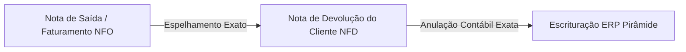
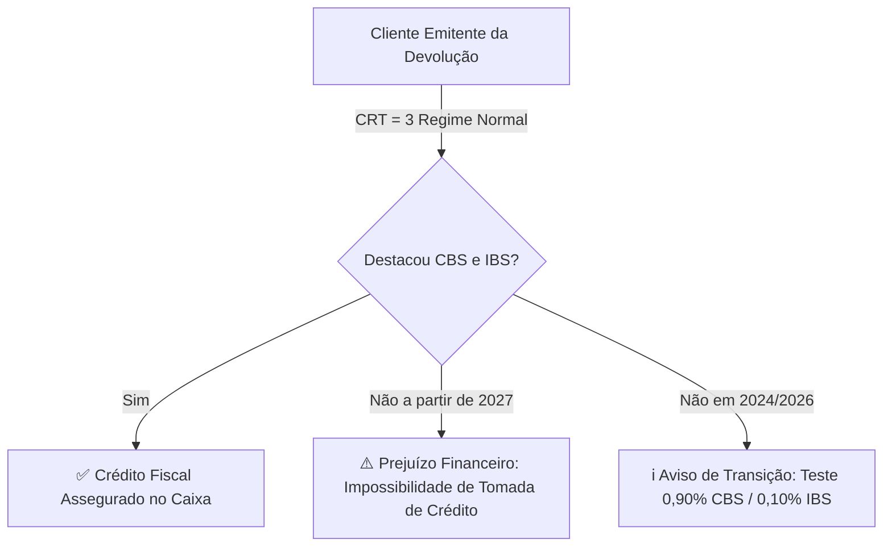

# PARECER TÉCNICO E MEMORIAL DE CÁLCULO FISCAL
## Validação Automática de Devoluções de Clientes (NFO x NFD)
**Destinatário:** Gerência Fiscal & Controladoria Tributária  
**Responsável Técnico:** Equipe de Engenharia de Software Fiscal  
**Data:** 25 de Agosto de 2026  
**Versão:** 1.0 — Homologação Operacional  
**Sistema de Destino:** ERP Pirâmide

---

### 1. OBJETIVO DO DOCUMENTO
Este documento consolida todas as **regras tributárias, fórmulas matemáticas, parâmetros por empresa e matrizes de CFOPs** implementadas no motor de validação fiscal do sistema. O objetivo é submeter à **Gerência Fiscal (Polliana)** o detalhamento técnico para conferência, validação e homologação oficial das regras aplicadas nas rotinas de entrada de notas fiscais de devolução.

---

### 2. PRINCÍPIO DA NOTA ESPELHO (DIRETRIZ CORE)

*   **Regra de Ouro:** A Nota Fiscal de Devolução emitida pelo cliente deve **reproduzir com exatidão matemática os destaques fiscais da Nota de Saída Original (NFO)**.
*   **Finalidade:** Garantir a perfeita anulação de débitos e créditos na SEFAZ e no livro fiscal do ERP Pirâmide, sem gerar passivos fiscais ou diferenças de apuração.
*   **Tratamento de Exceções:** Caso a nota de origem tenha sido emitida com alíquota ou benefício específico da época, a devolução deve seguir a nota de origem. Retificações fiscais posteriores devem ser feitas via Carta de Correção (CC-e) ou Nota Complementar, nunca distorcendo a NFD.

---

### 3. REGRAS POR DIVISÃO CORPORATIVA (PARAMETRIZAÇÃO DAS 4 EMPRESAS)

O sistema identifica automaticamente a empresa emissora da NFO através do CNPJ, UF e Razão Social:

| Divisão | CNPJ Base | UF | Alíquota Interna | Alíquota Interestadual | Regra Específica de Base de Cálculo de ICMS |
| :--- | :---: | :---: | :---: | :---: | :--- |
| **🏭 INDÚSTRIA INFAN** | `08.825.857/0001-38` | **PB** | **20,50%** | **12,00%** | • **NCM 3004 (Medicamentos):** Redução de Base de **9,90%** ($\text{Base} = \text{Valor} \times 0,901$). • **NCMs 3401.20.10, 3304.99.10, 3307.90.00 e 3401.30.00:** Redução de Base de **10,49%** ($\text{Base} = \text{Valor} \times 0,8951$). • **Demais NCMs:** Base Cheia (100%). |
| **🏢 QUESALON PB (Matriz)** | `04.792.134/0001-43` | **PB** | **20,00%** | **12,00%** | • **Base Cheia (100%)** para todos os NCMs e produtos. |
| **🏢 QUESALON EXTREMA (Filial MG)** | `04.792.134/0004-96` | **MG** | **12,00% ou 18,00%** *(Termo de Acordo MG)* | **12,00% / 7,00%** | • **Interna:** Alíquota praticada na NFO (12% ou 18% conforme enquadramento do produto). • **Interestadual Sul/Sudeste (exceto ES):** **12,00%**. • **Interestadual ES, Centro-Oeste, Norte e Nordeste:** **7,00%**. • Base Cheia (100%). |
| **🏢 QUEDES DISTRIBUIDORA** | `04.792.134/0002-24` | **AL** | *Sem vendas internas* | **12,00%** | • Linha exclusiva de medicamentos. • Apenas operações interestaduais a **12,00%**. • Base Cheia (100%). |

---

### 4. AUDITORIA DE DESCONTOS COMERCIAIS PROPORCIONAIS

Nas devoluções parciais, o sistema aplica com rigor a fórmula matemática repassada pela Gerência:

$$d_u = \frac{\text{Desconto Total do Item na NFO}}{\text{Quantidade Faturada na NFO}}$$

$$d_p = d_u \times q_{\text{devolvida}}$$

$$V_{\text{Líquido}} = (v_{\text{unCom}} \times q_{\text{devolvida}}) - d_p$$

#### Critérios de Validação:
1.  **Conformidade Proporcional:** O desconto informado na NFD ($vDesc$) deve corresponder a $d_p$ com tolerância de até **R$ 0,05** (para acomodar variações de dízimas de 4 casas decimais no XML).
2.  **Trava de Rejeição SEFAZ 483:** O sistema rejeita e emite alerta crítico se o desconto unitário for superior ao valor unitário do produto ($vDesc > vProd$).

---

### 5. AUDITORIA DE ICMS-ST (SUBSTITUIÇÃO TRIBUTÁRIA)

*   **Proporcionalidade da ST:** Quando a saída teve retenção de ST ($vBCST > 0$ e $vICMSST > 0$), a devolução parcial deve destacar exatamente:
    $$\text{vICMSST}_{\text{esperado}} = \text{vICMSST}_{\text{orig}} \times \left(\frac{q_{\text{devolvida}}}{Q_{\text{faturada}}}\right)$$
*   **Vedação de ST Indevida:** Se a nota de saída foi emitida sem destaque de ST (ex: operação isenta, interna normal ou NCM sem convênio ST), a nota de devolução **não pode conter destaque de ICMS-ST**.

---

### 6. MATRIZ DE CONVERSÃO DE CFOPS PARA O ERP PIRÂMIDE

O motor analisa o CFOP faturado na saída (NFO) e o CFOP emitido pelo cliente (NFD) e sugere automaticamente o CFOP exato de escrituração no ERP Pirâmide:

| Operação de Faturamento (NFO) | CFOP Saída | CFOP Devolução Cliente (NFD) | CFOP Entrada ERP Pirâmide | Descrição do Lançamento no Pirâmide |
| :--- | :---: | :---: | :---: | :--- |
| Venda Mercadoria Adquirida (Estadual) | **5.102 / 5.1021** | 5.202 | **1.202** | Devolução de compra para comercialização |
| Venda Produção do Estabelecimento | **5.101 / 5.1011** | 5.202 | **1.201** | Devolução de venda de produção |
| Venda com ICMS-ST (Estadual) | **5.401 / 5.4011 / 5.403 / 5.4031** | 5.411 | **1.411** | Devolução de compra com ST |
| Remessa em Bonificação / Doação | **5.910** | 5.949 | **1.949** | Outra entrada / Bonificação |
| Venda Mercadoria Adquirida (Interestadual) | **6.101 / 6.1011 / 6.102 / 6.1021** | 6.202 | **2.202** | Devolução interestadual de comercialização |
| Venda com ICMS-ST (Interestadual) | **6.403 / 6.4031** | 6.411 | **2.411** | Devolução interestadual compra com ST |
| Venda Suframa Comercialização | **6.110** | 6.202 | **2.204** | Devolução Suframa mercadoria adquirida |
| Venda Suframa Produção | **6.109** | 6.202 | **2.203** | Devolução Suframa produção do estabelecimento |

---

### 7. REFORMA TRIBUTÁRIA (IBS / CBS) E SEFAZ 2026

1.  **Proteção do Caixa (Vigência 2027):**
    *   Para clientes do Regime Normal (CRT=3), a devolução deve destacar IBS e CBS para que a empresa possa se creditar na apuração mensal.
    *   Alíquotas de referência da transição: **CBS Federal: 0,90%** (CST 09/01) e **IBS Estadual: 0,10%**.
2.  **Exigência SEFAZ 2026 (`<DFeReferenciado>`):**
    *   Conforme NT RTC v1.40 (Regra VC02-14), a partir de 01/09/2026, cada item deve conter a amarração do `nItem` e da chave da NFO no grupo `<DFeReferenciado>`. Omissão gera **Rejeição SEFAZ 321**.

---

### 8. RASTREABILIDADE REGULATÓRIA (ANVISA & NT 2021.004)

*   **Medicamentos (NCM 3004 / 3003):** Se o cliente omitir a tag `<rastro>` na devolução ($finNFe=4$), o sistema gera alerta informativo (`INFO`) para **conferência física mandatória na doca**, sem bloquear a nota na SEFAZ (conforme NT 2021.004).
*   **Vitaminas e Suplementos (NCM 2936, 2106, 2309):** Classificados como alimentos/suplementos, com dispensa regulatória de lote na SEFAZ.
*   **Validade Vencida:** Lotes devolvidos com data de validade vencida geram alerta de bloqueio e direcionamento automático para **Quarentena / Avaria**.

---

### 9. DIRECIONAMENTO LOGÍSTICO (52 MOTIVOS x ALMOXARIFADOS)

O sistema faz o parsing do campo de Informações Complementares (`<infCpl>`) ou observação do item (`<infAdProd>`) e direciona:
*   **ALMOX (Almoxarifado Geral de Venda):** Motivos comerciais normais (Desacordo Comercial, Pedido Duplicado, Cancelamento, Devolução Comercial).
*   **AVARIA (Almoxarifado de Avaria):** Quebra em transporte, avaria física no recebimento, produto molhado ou violado.
*   **QUARENTENA (Almoxarifado de Bloqueio):** Lote vencido, suspeita de desvio de temperatura ou conferência pendente.
*   **DEFEITO (Almoxarifado de Desvio de Qualidade):** Desvio fabril ou queixa técnica do cliente.

---

### 10. CHECKLIST DE CONFERÊNCIA E HOMOLOGAÇÃO DA GERÊNCIA FISCAL

Solicitamos que a Gerência Fiscal avalie os pontos abaixo e indique eventuais ajustes:

- [ ] **1. Alíquotas e Reduções da INFAN:** A redução de 9,90% (medicamentos) e 10,49% (cosméticos) atende integralmente à legislação vigente da Paraíba?
- [ ] **2. Matriz QUESALON Extrema:** A separação interestadual de 12% (Sul/Sudeste) vs 7% (Demais estados) e o Termo de Acordo em MG estão corretos?
- [ ] **3. Matriz de CFOPs do Pirâmide:** Os 8 CFOPs de entrada (1202, 1201, 1411, 1949, 2202, 2411, 2204, 2203) cobrem 100% das rotinas do ERP?
- [ ] **4. Tolerância de Desconto:** A tolerância de até R$ 0,05 para rateios de centavos atende às necessidades operacionais?
- [ ] **5. Regras de IBS/CBS 2026/2027:** As validações antecipadas da Reforma Tributária atendem aos requisitos de conformidade?

---

**Parecer da Gerência Fiscal:**  
( &nbsp; ) APROVADO SEM RESSALVAS  
( &nbsp; ) APROVADO COM AS SEGUINTES OBSERVAÇÕES: _____________________________________________  

**Data da Homologação:** _____ / _____ / 2026  
**Assinatura do Responsável:** ____________________________________________________  
